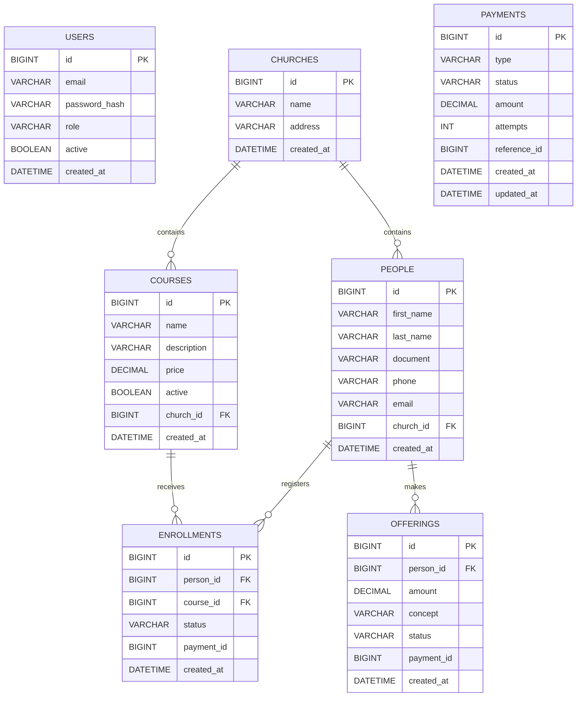

# README - Diagnóstico funcional y arquitectónico del proyecto `erp_iglesias`

## 1. Descripción general

Este documento presenta el análisis funcional y arquitectónico del proyecto **IglesiAdmin**, una aplicación web orientada a la **gestión parroquial**. El sistema permite administrar la iglesia, usuarios, personas, cursos, inscripciones, ofrendas y pagos, con autenticación basada en JWT.

El diagnóstico se realizó mediante **revisión estática del código fuente** del frontend, backend y archivos de infraestructura.  
**Importante:** en este entorno no fue posible ejecutar el backend con Maven ni validar el sistema de punta a punta en tiempo de ejecución; por tanto, la validación funcional aquí documentada está basada en la navegación del proyecto, el análisis del código y la trazabilidad entre pantallas, rutas, controladores, entidades y repositorios.

---

## 2. Alcance de la revisión

Se revisaron los siguientes elementos del proyecto:

- Estructura general del repositorio.
- Stack tecnológico del frontend, backend, base de datos e infraestructura.
- Módulos funcionales visibles en la interfaz y su correspondencia con la API.
- Flujos de usuario principales.
- Manejo de datos y persistencia.
- Integración entre frontend y backend.
- Estructura arquitectónica, separación de responsabilidades y acoplamiento.
- Reconocimiento de deuda técnica, antipatrones y malas prácticas.
- Modelo Entidad-Relación (MER) reconstruido a partir de las entidades JPA.

---

## 3. Estructura del proyecto

```text
erp_iglesias/
├── backend/
│   ├── pom.xml
│   ├── Dockerfile
│   └── src/main/java/com/iglesia/
│       ├── entidades JPA
│       ├── controladores REST
│       ├── repositorios JPA
│       ├── seguridad JWT
│       └── inicialización de datos
├── frontend/
│   ├── package.json
│   ├── angular.json
│   ├── Dockerfile
│   ├── nginx.conf
│   └── src/app/
│       ├── componentes standalone
│       ├── auth guard
│       ├── interceptor
│       ├── servicio API
│       └── rutas
└── docker-compose.yml
```

---

## 4. Stack tecnológico actual

## 4.1 Frontend

| Tecnología | Versión / evidencia | Uso |
|---|---:|---|
| Angular | `^17.3.0` | SPA principal |
| Angular Material | `^17.3.10` | Componentes UI |
| TypeScript | `~5.4.2` | Desarrollo frontend |
| RxJS | `~7.8.0` | Manejo reactivo de respuestas HTTP |
| SCSS | `angular.json` | Estilos |
| Nginx | `frontend/Dockerfile` + `nginx.conf` | Servir la app compilada |

## 4.2 Backend

| Tecnología | Versión / evidencia | Uso |
|---|---:|---|
| Java | 17 | Plataforma backend |
| Spring Boot | `3.2.3` | Framework principal |
| Spring Web | `pom.xml` | API REST |
| Spring Security | `pom.xml` | Autenticación/autorización |
| Spring Data JPA | `pom.xml` | Persistencia ORM |
| Jakarta Validation | `pom.xml` | Validación básica de entrada |
| JJWT | `0.11.5` | Generación y validación de JWT |

## 4.3 Base de datos

| Tecnología | Versión / evidencia | Uso |
|---|---:|---|
| PostgreSQL | `16` | Persistencia principal |

## 4.4 Infraestructura y despliegue

| Tecnología | Evidencia | Uso |
|---|---|---|
| Docker | `Dockerfile` en frontend y backend | Contenerización |
| Docker Compose | `docker-compose.yml` | Orquestación local |
| Eclipse Temurin JRE/JDK | `Dockerfile` backend | Runtime Java |
| Node Alpine | `Dockerfile` frontend | Build Angular |

---

## 5. Arquitectura general observada

La solución sigue una arquitectura **cliente-servidor** con separación física entre frontend y backend:

- **Frontend Angular**: consume la API REST, maneja autenticación con token en `localStorage`, usa guardas de ruta e interceptor HTTP.
- **Backend Spring Boot**: expone endpoints REST, autentica con JWT, aplica autorización con `@PreAuthorize`, persiste datos con JPA sobre PostgreSQL.
- **Base de datos PostgreSQL**: almacena usuarios, iglesia, personas, cursos, inscripciones, ofrendas y pagos.
- **Docker Compose**: levanta los tres servicios principales (`db`, `backend`, `frontend`).

En términos de estilo, es una aplicación **monolítica en backend**, con frontend desacoplado, pero **sin una división fuerte por capas de dominio/servicio/aplicación**.

---

## 6. Validación funcional del sistema

La validación funcional se hizo recorriendo las rutas del frontend y verificando sus endpoints asociados en backend.

## 6.1 Módulos identificados

| Módulo | Frontend | Backend | Funcionalidad observada | Estado |
|---|---|---|---|---|
| Login | `login.component.ts` | `AuthController` | Inicio de sesión con JWT | Implementado |
| Dashboard | `dashboard.component.ts` | `DashboardController` | Resumen de personas, cursos, ofrendas del mes y pagos pendientes | Implementado |
| Iglesia | `church.component.ts` | `ChurchController` | Registrar y consultar la iglesia | Implementado |
| Usuarios | `users.component.ts` | `UserController` | Crear usuarios con rol `CLIENT` | Implementado |
| Personas | `people.component.ts` | `PersonController` | Registrar y listar personas | Implementado |
| Cursos | `courses.component.ts` | `CourseController` | Crear y listar cursos | Implementado |
| Inscripciones | `enrollments.component.ts` | `EnrollmentController` | Relacionar persona + curso y generar pago pendiente | Implementado |
| Ofrendas | `offerings.component.ts` | `OfferingController` | Registrar ofrenda y generar pago pendiente | Implementado |
| Pagos | `payments.component.ts` | `PaymentController` | Confirmar, fallar y reintentar pagos | Implementado |

## 6.2 Rutas del frontend

```text
/login
/dashboard
/church
/users
/people
/courses
/enrollments
/offerings
/payments
```

Todas, excepto `/login`, están protegidas por `authGuard`.

## 6.3 Endpoints principales de la API

| Método | Endpoint | Descripción | Autorización |
|---|---|---|---|
| POST | `/api/auth/login` | Autenticación | Pública |
| GET | `/api/dashboard` | Resumen operativo | ADMIN / CLIENT |
| GET | `/api/church` | Consultar iglesia | Autenticado |
| POST | `/api/church` | Crear iglesia | ADMIN |
| POST | `/api/users` | Crear usuario client | ADMIN |
| GET | `/api/people` | Listar personas | ADMIN / CLIENT |
| POST | `/api/people` | Crear persona | ADMIN / CLIENT |
| GET | `/api/courses` | Listar cursos | ADMIN / CLIENT |
| POST | `/api/courses` | Crear curso | ADMIN |
| GET | `/api/enrollments` | Listar inscripciones | ADMIN / CLIENT |
| POST | `/api/enrollments` | Crear inscripción | ADMIN / CLIENT |
| GET | `/api/offerings` | Listar ofrendas | ADMIN / CLIENT |
| POST | `/api/offerings` | Crear ofrenda | ADMIN / CLIENT |
| GET | `/api/payments` | Listar pagos | ADMIN / CLIENT |
| POST | `/api/payments/{id}/confirm` | Confirmar pago | ADMIN / CLIENT |
| POST | `/api/payments/{id}/fail` | Marcar pago fallido | ADMIN / CLIENT |
| POST | `/api/payments/{id}/retry` | Reintentar pago | ADMIN / CLIENT |

---

## 7. Flujos de usuario identificados

## 7.1 Flujo de autenticación

1. El usuario accede al formulario de login.
2. El frontend envía `email` y `password` a `/api/auth/login`.
3. El backend valida credenciales y devuelve:
   - token JWT,
   - email,
   - rol.
4. El frontend guarda estos datos en `localStorage`.
5. El interceptor agrega el header `Authorization: Bearer <token>` a las solicitudes posteriores.

**Observación:** el formulario de login trae precargado el usuario administrador por defecto, lo cual facilita pruebas, pero no es recomendable para producción.

## 7.2 Flujo de configuración inicial

1. Se inicia sesión.
2. Se registra la iglesia en el módulo **Iglesia**.
3. A partir de allí, el resto de módulos dependen de que exista esa iglesia.

**Regla de negocio detectada:** el sistema está diseñado para que exista **una sola iglesia**.

## 7.3 Flujo de personas y cursos

1. Se crean personas.
2. Se crean cursos.
3. Ambos quedan asociados a la iglesia actual.

## 7.4 Flujo de inscripción

1. Se selecciona una persona.
2. Se selecciona un curso.
3. El backend crea una inscripción con estado `PENDIENTE`.
4. Luego crea un pago con tipo `INSCRIPCION_CURSO`.
5. Finalmente asocia el `paymentId` a la inscripción.

## 7.5 Flujo de ofrendas

1. Se selecciona una persona.
2. Se ingresa monto y concepto.
3. El backend crea una ofrenda con estado `PENDIENTE`.
4. Luego crea un pago con tipo `OFRENDA`.
5. Finalmente asocia el `paymentId` a la ofrenda.

## 7.6 Flujo de pagos

1. El módulo de pagos lista todos los pagos.
2. El usuario puede:
   - **Confirmar**: cambia el pago a `CONFIRMADO`.
   - **Fallar**: incrementa intentos y cambia el estado a `FALLIDO`.
   - **Reintentar**: vuelve a `INICIADO` si no supera 3 intentos.
3. Si el pago se confirma:
   - la inscripción pasa a `PAGADA`, o
   - la ofrenda pasa a `REGISTRADA`.

---

## 8. Integración entre frontend y backend

La integración está centralizada en `api.service.ts`, donde el frontend expone métodos que corresponden casi 1 a 1 con los endpoints REST del backend.

### Hallazgos positivos

- El consumo de la API está centralizado.
- Existe interceptor para inyectar JWT automáticamente.
- El guard protege rutas privadas.
- La estructura de componentes refleja de forma clara los módulos del backend.

### Hallazgos a tener en cuenta

- La URL base del backend está **hardcodeada** como:
  ```ts
  private readonly baseUrl = 'http://localhost:8080/api';
  ```
  Esto reduce flexibilidad entre ambientes.
- El frontend muestra enlaces a módulos aunque el rol no necesariamente tenga permiso real en backend.
- No existe manejo global de errores HTTP; cada componente gestiona mensajes por separado.
- El frontend valida autenticación solo por existencia del token, no por expiración o integridad.

---

## 9. Manejo de datos y persistencia

## 9.1 Entidades detectadas

- `AppUser`
- `Church`
- `Person`
- `Course`
- `Enrollment`
- `Offering`
- `Payment`

## 9.2 Enumeraciones de negocio

- `UserRole`: `ADMIN`, `CLIENT`
- `EnrollmentStatus`: `PENDIENTE`, `PAGADA`
- `OfferingStatus`: `PENDIENTE`, `REGISTRADA`
- `PaymentStatus`: `INICIADO`, `CONFIRMADO`, `FALLIDO`
- `PaymentType`: `INSCRIPCION_CURSO`, `OFRENDA`

## 9.3 Reglas de persistencia observadas

- Se usa `spring.jpa.hibernate.ddl-auto=update`.
- La base de datos se genera/actualiza automáticamente.
- Los timestamps se almacenan en entidades mediante inicialización directa con `LocalDateTime.now()`.
- La mayoría de relaciones usan `@ManyToOne(fetch = FetchType.LAZY)`.
- El sistema no maneja borrado lógico ni auditoría completa.
- No hay migraciones versionadas con Flyway o Liquibase.

## 9.4 Manejo de consistencia

Las operaciones de inscripción y ofrenda son **multietapa**:

- crear entidad principal,
- crear pago,
- actualizar entidad principal con `paymentId`.

Igualmente, confirmar pago actualiza:
- el pago,
- luego la inscripción u ofrenda relacionada.

**Problema detectado:** estas secuencias no están anotadas con `@Transactional`, lo que puede dejar inconsistencias si ocurre un error intermedio.

---

## 10. Modelo Entidad-Relación (MER)



### Nota sobre el MER

El modelo relacional real de negocio tiene una particularidad:

- `ENROLLMENTS.paymentId` y `OFFERINGS.paymentId` se guardan como campos escalares.
- `PAYMENTS.referenceId` apunta al `id` de una inscripción o de una ofrenda, según `type`.

Es decir, **la relación entre pago e inscripción/ofrenda no está modelada con claves foráneas formales JPA**, sino con referencias manuales.

---

## 11. Diagnóstico arquitectónico

## 11.1 Estructura del código

El backend está organizado en un único paquete:

```text
com.iglesia
```

Dentro de este paquete conviven:

- entidades,
- repositorios,
- controladores,
- seguridad,
- utilidades JWT,
- inicializador de datos.

### Evaluación

Esta estructura funciona para un proyecto pequeño o académico; sin embargo, **escala mal** cuando aumentan los módulos, reglas de negocio o integraciones.

### Riesgo

- Baja cohesión por contexto de negocio.
- Alta dificultad para ubicar responsabilidades.
- Mayor probabilidad de mezclar lógica de presentación, negocio y persistencia.

---

## 11.2 Separación de responsabilidades

### Hallazgo principal

La lógica de negocio está concentrada mayoritariamente en los **controladores REST**.

Ejemplos:

- `EnrollmentController` crea inscripción, valida pertenencia a iglesia, crea pago y actualiza inscripción.
- `OfferingController` crea ofrenda, crea pago y actualiza ofrenda.
- `PaymentController` cambia estado del pago y además modifica inscripción u ofrenda.
- Varios controladores implementan su propio método `requireChurch()`.

### Evaluación

La separación de responsabilidades es **débil**.  
No existe una capa de servicios clara que encapsule reglas de negocio reutilizables.

### Consecuencias

- Mayor acoplamiento.
- Duplicación de reglas.
- Menor testabilidad.
- Mayor riesgo de errores al extender funcionalidades.

---

## 11.3 Acoplamiento entre módulos

### Acoplamiento detectado

- Los controladores dependen directamente de múltiples repositorios.
- El módulo de pagos conoce detalles de inscripciones y ofrendas.
- La existencia de una sola iglesia está implícita en muchos módulos.
- El frontend depende directamente de una URL fija del backend.
- La UI no diferencia claramente permisos por rol en navegación.

### Nivel de acoplamiento

**Medio-alto** para el tamaño actual del sistema.

### Impacto

Hoy el proyecto puede sostenerse porque es pequeño; sin embargo, al crecer, este acoplamiento dificultará cambios como:

- soporte multiiglesia,
- nuevos tipos de pago,
- nuevos roles,
- reportes,
- integraciones externas.

---

## 11.4 Escalabilidad

### Puntos a favor

- Frontend y backend están separados.
- Se puede desplegar con contenedores.
- PostgreSQL permite crecimiento razonable.
- Los módulos principales están claramente delimitados a nivel funcional.

### Limitantes actuales

- La aplicación asume una **única iglesia global**.
- No hay paginación ni filtros robustos.
- No hay capa de servicios para soportar crecimiento del dominio.
- No hay manejo transaccional explícito.
- No se observa cache, colas, eventos ni desacoplamiento de procesos.
- La seguridad y configuración están orientadas a entorno local.

### Diagnóstico

La escalabilidad actual es **suficiente para un MVP o proyecto académico**, pero **insuficiente para producción real con múltiples organizaciones o alta concurrencia**.

---

## 11.5 Mantenibilidad

### Aspectos positivos

- Código relativamente corto y legible.
- Uso de nombres de dominio claros.
- Componentes frontend por módulo.
- DTOs ligeros mediante `record` en varios controladores.
- Seguridad básica funcional con JWT.
- Docker Compose simplifica el arranque local.

### Aspectos negativos

- Falta de capas bien definidas.
- Reglas repetidas.
- Ausencia de pruebas.
- Configuraciones hardcodeadas.
- Errores manejados de forma local en cada componente.
- Dependencia de convenciones implícitas, por ejemplo: “solo existe una iglesia”.

### Diagnóstico

La mantenibilidad es **media-baja**.  
Todavía es viable modificar el sistema, pero la deuda técnica crecerá rápido si se agregan nuevas funcionalidades sin refactorización previa.

---

## 12. Fortalezas identificadas

1. **Separación frontend/backend clara**.  
2. **Autenticación JWT funcional**.  
3. **Uso de roles con `@PreAuthorize`**.  
4. **Modelo de dominio entendible** para el contexto parroquial.  
5. **Flujos funcionales conectados**: inscripción/ofrenda → pago → cambio de estado.  
6. **Contenerización** con Docker y Compose.  
7. **Uso de Angular Material**, que da una base UI consistente.  
8. **Inicialización automática de admin**, útil para pruebas y demo.

---

## 13. Antipatrones y malas prácticas detectadas

## 13.1 Resumen ejecutivo

El proyecto no presenta un caos estructural, pero sí acumula varios antipatrones típicos de un MVP o proyecto académico que aún no ha pasado por una refactorización formal.

## 13.2 Tabla de hallazgos

| Hallazgo | Tipo | Evidencia | Impacto |
|---|---|---|---|
| Lógica de negocio en controladores | Antipatrón | `EnrollmentController`, `OfferingController`, `PaymentController` | Baja testabilidad y alto acoplamiento |
| Único paquete `com.iglesia` | Mala práctica estructural | Backend completo | Crecimiento desordenado |
| Duplicación de `requireChurch()` | Duplicación de lógica | Varios controladores | Mantenimiento costoso |
| Relación pago-inscripción/ofrenda por IDs manuales | Primitive Obsession / relación débil | `paymentId`, `referenceId` | Riesgo de inconsistencias |
| Ausencia de `@Transactional` en operaciones críticas | Mala práctica transaccional | Creación y confirmación de pagos | Posible corrupción lógica |
| URL del backend hardcodeada | Configuración rígida | `api.service.ts` | Baja portabilidad |
| CORS hardcodeado a localhost | Configuración rígida | `SecurityConfig` | Problemas al desplegar |
| JWT secret por defecto visible | Riesgo de seguridad | `application.properties` y `docker-compose.yml` | Exposición de seguridad |
| Usuario admin por defecto fijo | Riesgo de seguridad | `DataInitializer` | Credenciales previsibles |
| Login precargado con admin/clave | Mala práctica de seguridad/UX | `login.component.ts` | Riesgo en ambientes reales |
| Sin pruebas unitarias/integración | Deuda técnica | No se observan tests | Baja confianza en cambios |
| Navegación sin restricción visual por rol | Inconsistencia UI/seguridad | Menú lateral | Usuario ve opciones que pueden fallar con 403 |
| `ddl-auto=update` | Riesgo operativo | `application.properties` | Cambios de esquema no controlados |
| Listado de pagos sin filtro por iglesia | Riesgo de aislamiento | `PaymentController` | Problema grave si se soporta multiiglesia |
| Métrica de ofrendas del dashboard cuenta registros, no suma monto | Ambigüedad funcional | `DashboardController` | Indicador posiblemente engañoso |
| Posible N+1 en carga de pagos asociados | Antipatrón de acceso a datos | `list()` de inscripciones/ofrendas | Ineficiencia al escalar |
| Código muerto o poco aprovechado | Olor a código | métodos/repositorios/beans no usados claramente | Complejidad innecesaria |

---

## 14. Problemas y deuda técnica existente

## 14.1 Deuda técnica alta prioridad

1. **Falta de capa de servicios**
   - Debe extraerse la lógica de negocio desde controladores hacia servicios.

2. **Falta de transacciones**
   - Operaciones compuestas deben ser atómicas.

3. **Modelado débil de pagos**
   - Debe mejorarse la relación entre `Payment` y las entidades de negocio.

4. **Configuración hardcodeada**
   - Frontend y backend deben usar variables de entorno o perfiles.

5. **Ausencia de pruebas**
   - Se requieren pruebas unitarias y de integración.

## 14.2 Deuda técnica media prioridad

1. Refactorizar backend por paquetes:
   - `auth`
   - `church`
   - `people`
   - `courses`
   - `enrollments`
   - `offerings`
   - `payments`
   - `shared`

2. Implementar manejo global de excepciones con `@ControllerAdvice`.

3. Añadir paginación y filtros.

4. Restringir navegación frontend según rol.

5. Añadir logs estructurados.

## 14.3 Deuda técnica baja prioridad

1. Mejorar UX de formularios.
2. Añadir edición y eliminación controlada.
3. Mejorar reportes del dashboard.
4. Incorporar auditoría completa.

---

## 15. Recomendaciones de mejora

## 15.1 Corto plazo

- Extraer lógica de negocio a servicios:
  - `AuthService`
  - `ChurchService`
  - `PersonService`
  - `CourseService`
  - `EnrollmentService`
  - `OfferingService`
  - `PaymentService`

- Añadir `@Transactional` en:
  - creación de inscripción,
  - creación de ofrenda,
  - confirmación de pago,
  - fallo y reintento de pago si afectan negocio.

- Mover configuraciones sensibles a variables de entorno reales.
- Quitar credenciales precargadas del login.
- Implementar manejo global de errores.

## 15.2 Mediano plazo

- Reorganizar backend por contextos de dominio.
- Reemplazar `referenceId` por relaciones más sólidas o una abstracción clara de pagos.
- Implementar migraciones con Flyway o Liquibase.
- Añadir pruebas unitarias y de integración.
- Implementar control visual por roles en frontend.

## 15.3 Largo plazo

- Diseñar soporte real para múltiples iglesias.
- Añadir reportes financieros y operativos.
- Implementar auditoría de acciones.
- Evaluar separación más fuerte por capas o arquitectura hexagonal si el sistema crece.

---

## 16. Valoración final

## Diagnóstico funcional

El sistema **sí tiene coherencia funcional**. Los módulos están conectados y reflejan un flujo lógico de operación parroquial:

- autenticación,
- configuración de iglesia,
- gestión de personas,
- gestión de cursos,
- inscripciones,
- ofrendas,
- pagos.

Desde el punto de vista funcional, el proyecto cumple como una **primera versión operativa** o **MVP académico**.

## Diagnóstico arquitectónico

La arquitectura actual es **simple y funcional**, pero aún **inmadura** para crecimiento sostenido.  
Su principal debilidad no está en la tecnología elegida, sino en la **organización interna del backend**, el **acoplamiento de la lógica**, la **debilidad del modelo de pagos** y la **falta de controles de mantenibilidad**.

## Conclusión general

**IglesiAdmin es una base válida para continuar evolucionando**, pero antes de escalar el alcance del producto conviene hacer una refactorización arquitectónica que fortalezca:

- separación de responsabilidades,
- consistencia transaccional,
- seguridad,
- mantenibilidad,
- escalabilidad.

---

## 17. Evidencias principales usadas para este diagnóstico

### Backend
- `pom.xml`
- `application.properties`
- `SecurityConfig.java`
- `AuthController.java`
- `ChurchController.java`
- `UserController.java`
- `PersonController.java`
- `CourseController.java`
- `EnrollmentController.java`
- `OfferingController.java`
- `PaymentController.java`
- `DashboardController.java`
- entidades y repositorios JPA
- `DataInitializer.java`

### Frontend
- `package.json`
- `angular.json`
- `app.routes.ts`
- `auth.guard.ts`
- `auth.interceptor.ts`
- `auth.service.ts`
- `api.service.ts`
- componentes:
  - `login`
  - `dashboard`
  - `church`
  - `users`
  - `people`
  - `courses`
  - `enrollments`
  - `offerings`
  - `payments`

### Infraestructura
- `docker-compose.yml`
- `backend/Dockerfile`
- `frontend/Dockerfile`
- `frontend/nginx.conf`

---
